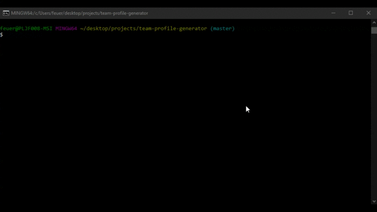
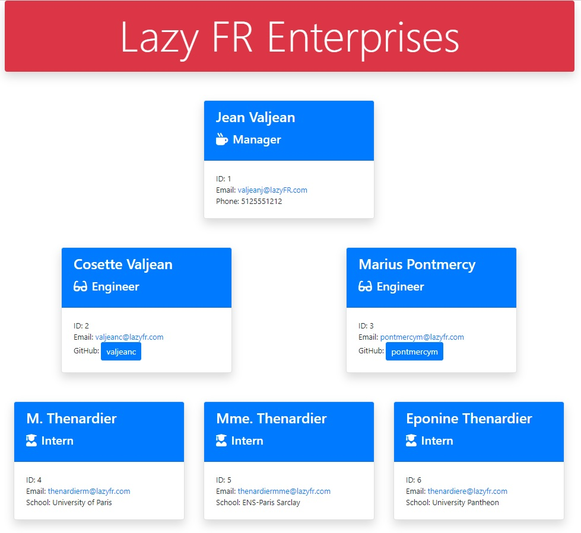
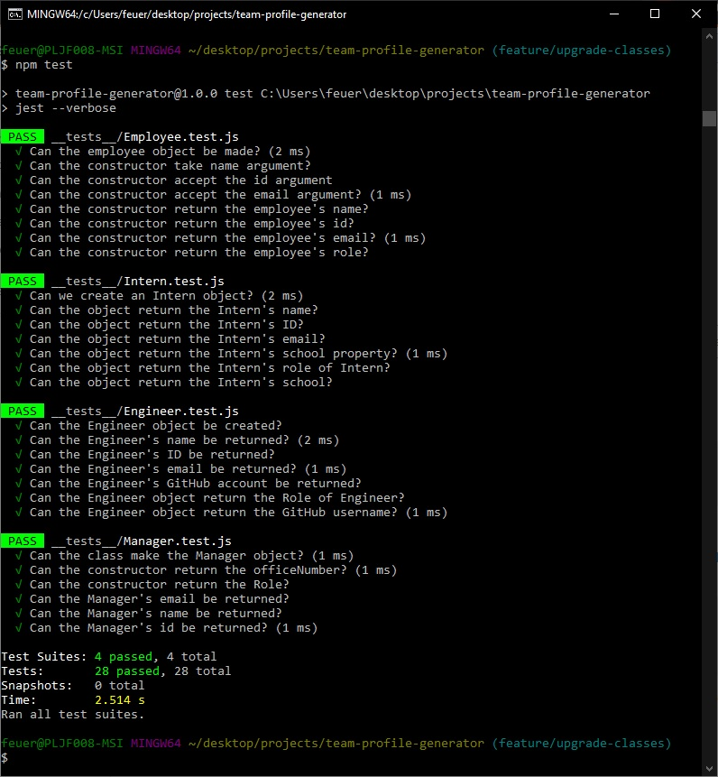

# Team Profile Generator

  

## Table of Contents
* [Description](#description)
* [Installation](#installation)
* [Usage](#usage)
* [License](#license)
* [Contributions](#contributions)
* [Tests](#tests)
* [Contact Me](#contact-me)

## Description
This program was written to provide a simple, graphical interface of a team's hierarchy using a web page.

## Installation
Clone a copy of team-profile-generator from GitHub on to a computer with NPM installed.  Using a program such as Bash, navigate to the team-profile-generator folder and instrall Inquirer.  After it has been downloaded and installed, type "node Index.js" and follow the instructions.

## Usage
By following the prompts on the screen, the user can create a graphical hierarchy of a team.  This gives the user the ability to quickly look up a user based on where they are in the corporate chain and retrieve information such as GitHub accounts, email addresses, sponsored schools, and so forth. When finished, an Index.html file will be created in the Dist folder which will look similar to this...

## License
MIT License

Copyright (c) 2020 Brent Feuerbacher

Permission is hereby granted, free of charge, to any person obtaining a copy
of this software and associated documentation files (the "Software"), to deal
in the Software without restriction, including without limitation the rights
to use, copy, modify, merge, publish, distribute, sublicense, and/or sell
copies of the Software, and to permit persons to whom the Software is
furnished to do so, subject to the following conditions:

The above copyright notice and this permission notice shall be included in all
copies or substantial portions of the Software.

THE SOFTWARE IS PROVIDED "AS IS", WITHOUT WARRANTY OF ANY KIND, EXPRESS OR
IMPLIED, INCLUDING BUT NOT LIMITED TO THE WARRANTIES OF MERCHANTABILITY,
FITNESS FOR A PARTICULAR PURPOSE AND NONINFRINGEMENT. IN NO EVENT SHALL THE
AUTHORS OR COPYRIGHT HOLDERS BE LIABLE FOR ANY CLAIM, DAMAGES OR OTHER
LIABILITY, WHETHER IN AN ACTION OF CONTRACT, TORT OR OTHERWISE, ARISING FROM,
OUT OF OR IN CONNECTION WITH THE SOFTWARE OR THE USE OR OTHER DEALINGS IN THE
SOFTWARE.

## Contributions
I do not need contributors at this time.

## Tests
While I do not have a formal testing procedure in place for the finished product, jest was used during the creation of classes and procedures for object creation.

## Contact Me
* [Email](mailto:feuerbacherb@gmail.com)

* [GitHub](https://www.github.com/feuerbacherb)
